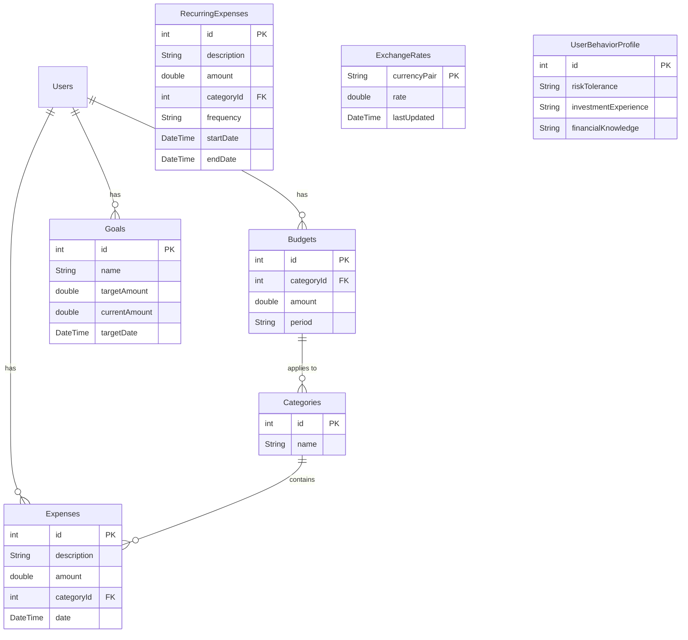

# Budgie - Personal Finance Management App

Budgie is a comprehensive personal finance management application designed to empower users with the tools and insights they need to take control of their financial lives. By offering a suite of powerful features, from intelligent expense tracking to personalized budgeting and goal setting, Budgie goes beyond simple bookkeeping to provide a holistic view of your financial health.

## Core Features

- **Intelligent Expense Tracking**: Automatically categorize expenses from transaction notifications using a sophisticated on-device machine learning model.
- **Personalized Budgeting**: Create custom budgets tailored to your spending habits and financial goals.
- **Goal Management**: Set, track, and manage your financial goals, with intelligent insights to help you stay on track.
- **Data-Driven Insights**: Visualize your spending patterns, analyze your financial health, and receive personalized recommendations.
- **Multi-Currency Support**: Seamlessly manage your finances in multiple currencies, with real-time exchange rate updates.
- **Secure and Private**: Your financial data is stored securely on your device, ensuring complete privacy and control.

## System Architecture

Budgie is built using a clean, scalable, and maintainable architecture that separates concerns into three distinct layers:

- **Presentation Layer**: The user interface of the application, built with Flutter and using the Provider package for state management.
- **Domain Layer**: The business logic of the application, containing the core use cases and business entities.
- **Data Layer**: The data access layer, responsible for fetching data from local and remote data sources.

The application follows the "Repository" pattern to abstract the data sources from the domain layer, making it easy to switch between different data providers without affecting the business logic.

See also: `docs/Architecture_Audit.md` for current audit notes, misplacements, and non-breaking structural actions applied.

### Architectural Diagram
```mermaid
graph TD
    A[Presentation Layer] --> B[Domain Layer]
    B --> C[Data Layer]
    C --> D[Local Database (Drift)]
    C --> E[Remote Services (Firebase)]

    subgraph Presentation Layer
        A1[UI (Widgets & Screens)]
        A2[State Management (Provider)]
    end

    subgraph Domain Layer
        B1[Use Cases]
        B2[Entities]
        B3[Repositories (Abstract)]
    end

    subgraph Data Layer
        C1[Repositories (Implementation)]
        C2[Data Sources (Local & Remote)]
    end
```

## Database Design

Budgie uses the `Drift` (formerly Moor) library to manage its local SQLite database. The database is designed to store all the application's data, including expenses, budgets, goals, and user preferences.

The database schema is defined in the `lib/data/local/database/app_database.dart` file and consists of the following tables:

- **Expenses**: Stores all the user's expenses, including the amount, category, date, and description.
- **Budgets**: Stores the user's budgets for different categories.
- **Goals**: Stores the user's financial goals, including the target amount and current savings.
- **Categories**: Stores the different expense categories.
- **RecurringExpenses**: Stores information about recurring expenses.
- **ExchangeRates**: Caches exchange rates to minimize network requests.
- **UserBehaviorProfile**: Stores user's financial behavior profile.

### Database Schema Diagram



## AI and Machine Learning

Budgie currently supports a hybrid detection approach:
- Local TFLite classifier to detect if a notification contains an expense
- Backend (FastAPI) extraction for structured details

If you choose to move to API-only, remove TFLite dependencies and assets as described in `docs/Architecture_Audit.md`.

## Getting Started

To run the application on your local machine, follow these steps:

1.  **Clone the repository**:
    ```bash
    git clone https://github.com/your-username/budgie.git
    ```
2.  **Install dependencies**:
    ```bash
    flutter pub get
    ```
3.  **Run the application**:
    ```bash
    flutter run
    ``` 